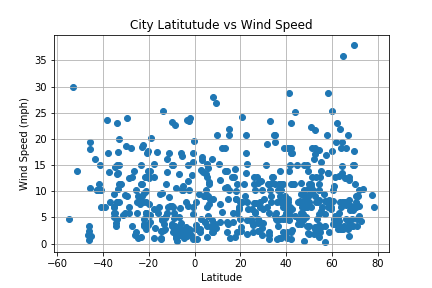

# Web-Design-Challenge

Web Visualization Dashboard (Latitude)

This web design challenge is to employ html, css, and bootstrap to visualize the weather analysis performed in my previous project: https://github.com/mvongjesda/Python-API-Challenge

Utlizing OpenWeatherMap's API, weather from a random set of >500 cities was compared in latitude along with temperature, humidity, cloudiness, and wind speeds. Data was plotted in scatter plots in the format of Latitude vs Variable using the Pandas and Matplotlib Python library.  Clicking on each plot links to anothe page more in-depth analysis.

  

  

  

